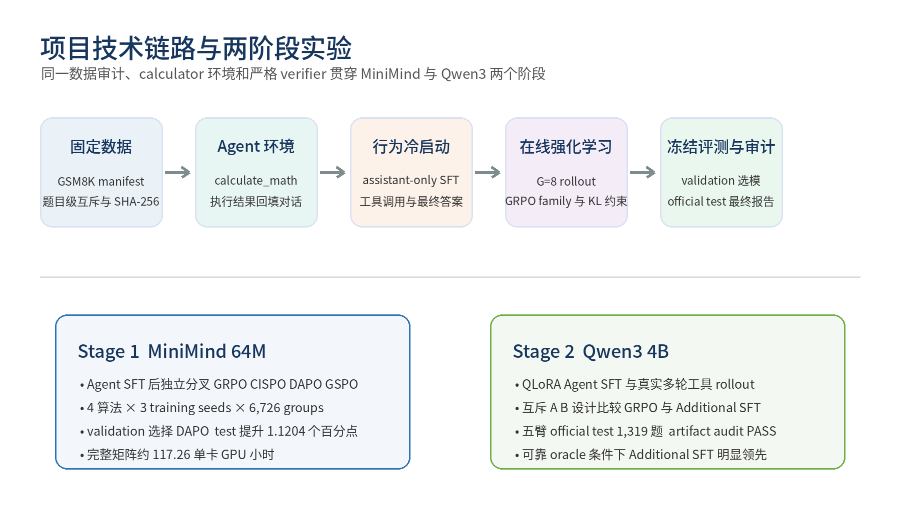
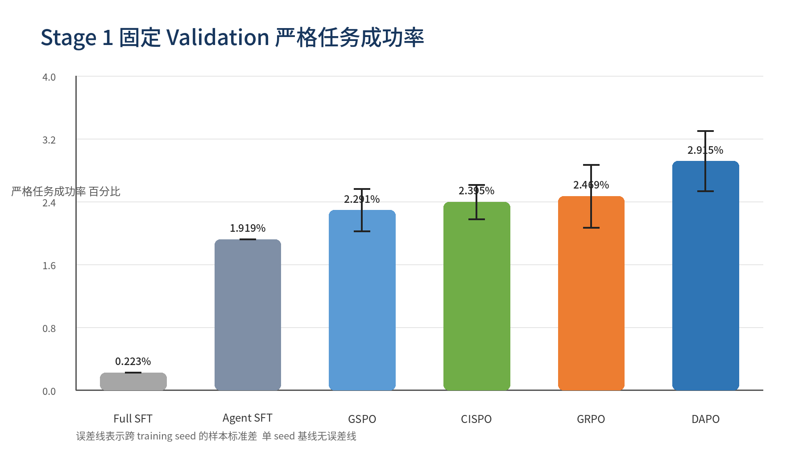
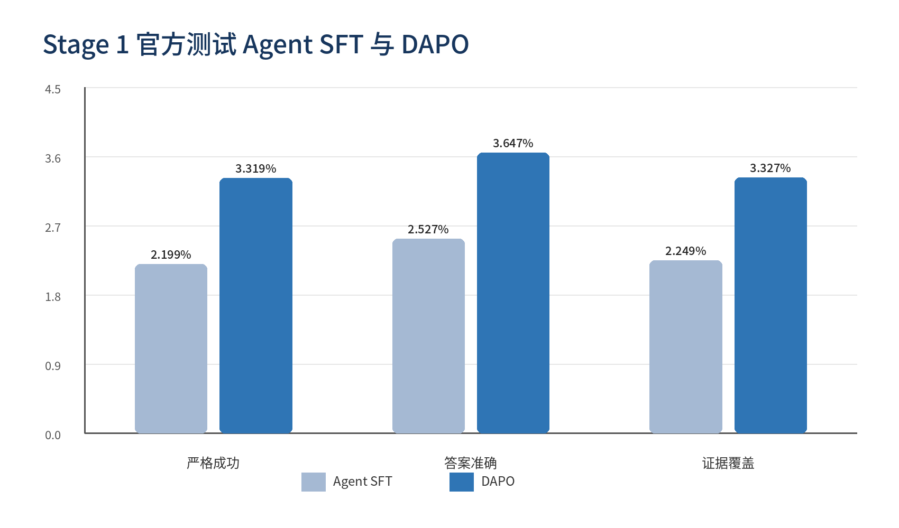
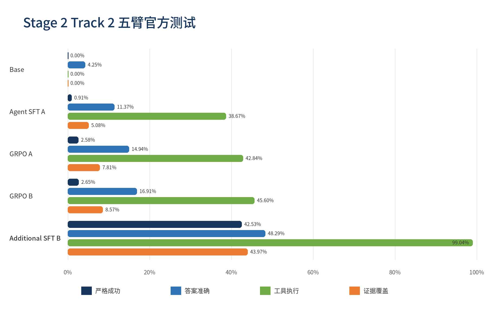
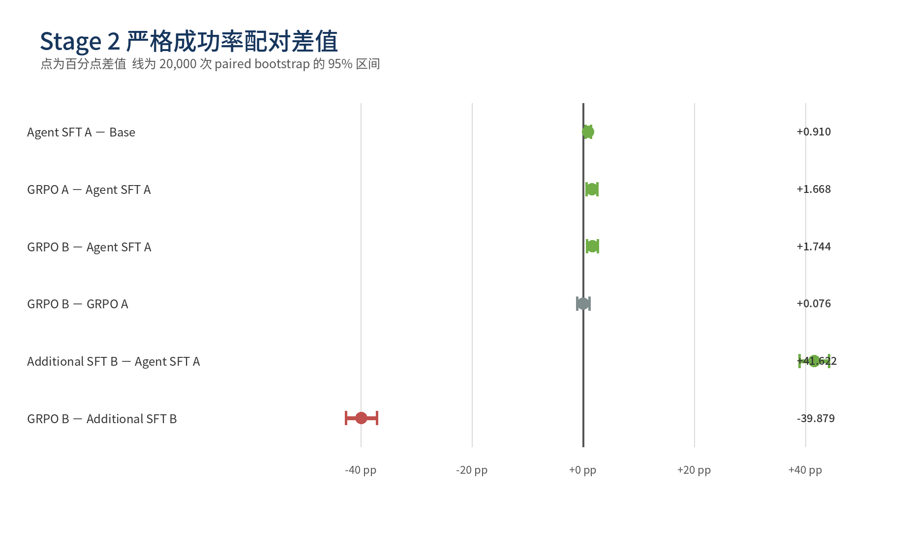

# miniLLM-RL：Agentic RL 完整实验报告

> 报告日期：2026-10-09
> 项目仓库：`Mini-RL` / `gsm8k-agentic-rl`
> 正式完成范围：Stage 1 MiniMind-64M；Stage 2 Track 1/2 Qwen3-4B；SVAMP SFT-init GRPO
> 最终回归：72/72 tests PASS
> Stage 2 Track 1、Track 2 与 SVAMP 结果审计：PASS

## 1. 执行摘要

本项目完成了从 GSM8K 数据准备、Agent 工具轨迹构造、Agent-SFT（RL 系统的冷启动训练）、在线强化学习、冻结验证、官方测试到结果审计的一整套 Agentic RL 实验闭环。模型并非只输出固定格式的数学答案，而是在 rollout 中生成 `calculate_math` 工具调用，由环境真实执行表达式、回填 observation，再由模型继续生成最终回答；严格 verifier 同时检查答案、调用、执行、必需工具覆盖和证据一致性。

项目形成了四组互补证据：

1. **Stage 1 MiniMind-64M 算法比较**：从同一个 Agent-SFT 起点独立训练 GRPO、CISPO、DAPO、GSPO，各 3 个训练种子。DAPO 在 validation 排名第一，并在未参与选择的 1,319 道 official test 上将严格成功率从 2.1986% 提升到 3.3190%，绝对提升 1.1204 个百分点。
2. **Stage 2 Track 2 Qwen3-4B 路线比较**：完成 Base、Agent-SFT(A)、GRPO(A)、GRPO(B)、Additional-SFT(B) 五臂实验。GRPO 相对 Agent-SFT 取得小幅但可测的增益；使用可靠 B 轨迹继续 SFT 达到 42.5322% 严格成功率，远高于 GRPO(B) 的 2.6535%。这说明当前模型、初始化和稀疏 strict reward 下，高质量 Agent oracle 的监督密度远高于纯在线 RL 信号。
3. **Stage 2 Track 1 Qwen3-4B 初始化消融**：以 Base、Pure GRPO、SFT only、SFT→GRPO 四臂拆分 Agent-SFT 冷启动训练、Base-init GRPO 和 Agent-SFT-init GRPO 的贡献。两条 GRPO 使用相同数据、shaped reward 和 53,808 轨迹预算，唯一核心差异是是否从 Agent-SFT adapter 初始化。Pure 完成全部预算但 validation strict/tool execution 仍为 0；SFT-only 与 SFT→GRPO 的 official-test strict 分别为 37.604% 和 67.475%。
4. **SVAMP 跨数据集 SFT-init GRPO**：从 GSM8K Additional-SFT(B) adapter 出发，在 816 条 SVAMP train prompt 上完成 6,528 条轨迹，184 题 holdout strict 从 67.935% 提升到 76.087%，终态审计 PASS。该结果表明在协议已经可达时，GRPO 可以把增量用于新的题目分布。

核心结果概览：

| 阶段 | 模型规模 | 正式问题 | 最佳正式结果 | 主要结论 |
|---|---:|---|---:|---|
| Stage 1 | MiniMind 63.91M | 四种 group-relative RL 算法谁更优 | DAPO test strict 3.3190% | DAPO 相对 Agent-SFT +1.1204 pp |
| Stage 2 Track 2 | Qwen3-4B + QLoRA | Agent-SFT 冷启动训练、已见/未见 RL 数据与追加 SFT 的差异 | Additional-SFT(B) strict 42.5322% | GRPO 有小幅增益，但可靠 oracle 下追加 SFT 明显更强 |
| Stage 2 Track 1 | Qwen3-4B + QLoRA | Agent-SFT 初始化是否改变 GRPO 的协议可达性 | SFT→GRPO test strict 67.4754% | Pure 答案改善但协议为 0；SFT-init GRPO 相对 SFT-only +29.871 pp |
| SVAMP transfer | Qwen3-4B + QLoRA | 已有协议后 RL 能否迁移到新分布 | SFT-init GRPO holdout strict 76.0870% | 相对未更新 SFT adapter +8.152 pp |

**术语口径：** Agent-SFT 是 RL 系统的冷启动训练。Pure GRPO 记为 Base-init GRPO（没有 Agent-SFT 初始化），SFT→GRPO 记为 Agent-SFT-init GRPO。GRPO 分支统一按初始化来源命名，避免把 RL 系统的“冷启动训练”与 GRPO 的起始 checkpoint 混为一谈。



*图 1　项目技术链路。数据边界、真实 calculator 环境和严格 verifier 贯穿两个模型阶段。*

## 2. 研究目标与 Agentic RL 定义

### 2.1 项目要回答的问题

本项目并不把“输出一个带 XML 标签的答案”视为 Agentic RL。正式实验试图回答以下问题：

- 小模型能否通过 Agent-SFT 获得工具调用行为先验；
- 在同一 Agent-SFT 冷启动训练起点上，不同 group-relative 策略目标是否产生可复现差异；
- 强化学习得到的收益能否在未参与选模的 official test 上保持；
- 在相同 shaped-GRPO 协议下，Base-init GRPO 和 Agent-SFT-init GRPO 是否进入不同的可优化行为区域；
- 对更大的 Qwen3-4B，当同一批题既可用于在线 RL 又有可靠 oracle 时，GRPO 和继续 SFT 的效果有何差异；
- 已经掌握工具协议的策略，能否在新的 SVAMP 分布上继续通过 GRPO 获得 holdout 增量；
- 稀疏奖励、控制 token、padding、精度、量化、日志与 KL 稳定性等工程因素如何影响可优化性。

### 2.2 本项目中 Agentic RL 的判定标准

一条正式轨迹经历以下状态转换：

```text
GSM8K question + tool schema
  → policy 生成 <tool_call> 和 calculate_math 参数
  → parser 校验标签、JSON、工具名与参数
  → safe_calculate 执行有界算术文法
  → environment 回填 tool observation
  → policy 基于 observation 继续生成最终答案
  → verifier 联合检查答案、调用、执行、覆盖和证据
  → reward 与组内相对优势更新 policy
```

因此它具备 Agentic RL 的三个关键成分：模型产生动作、环境改变状态并返回 observation、奖励由完整交互轨迹决定。只猜对数字、伪造工具结果、输出正确格式但没有真实执行、执行错误表达式后再猜答案，都不能得到严格成功奖励。

### 2.3 SFT 是否真正调用工具

SFT 是离线行为克隆，训练时不重新调用 calculator。数据生成阶段已经把 GSM8K 解答中的 `<<expression=result>>` 标注交给安全 calculator 回放，并只保留表达式、结果和最终答案彼此一致的可靠轨迹：

```text
system     工具规则与 schema                 条件 token
user       数学问题                          条件 token
assistant  <tool_call>...</tool_call>        监督 token
tool       <tool_response>...</tool_response> 条件 token
assistant  最终答案                          监督 token
```

因此 SFT 不只是学习“最终答案格式”，还学习选择工具、生成合法参数、结束工具调用、读取 observation、继续作答和停止；但 tool observation 是环境状态，不是模型动作，不进入 assistant-only loss。真正的在线工具执行发生在 RL rollout 和评测阶段。

## 3. 数据集、边界与可复现性

### 3.1 Stage 1 数据

GSM8K 官方 train 的 7,473 题按固定种子进行题目级拆分；官方 test 始终保持隔离。

| 文件 | 行数 | 用途 | SHA-256 |
|---|---:|---|---|
| `train_rl.jsonl` | 6,726 | 正式 RL prompt | `ec9aecf7083386226e17f9eead206b4e045e952ac2c28080f9c9120da74fbf3e` |
| `train_sft.jsonl` | 6,637 | 可靠 Agent oracle 轨迹 | `132a54eb2266ac75ea44c4055ca6ce3661df5b80aa556ff1b602366cdbf772cb` |
| `validation_rl.jsonl` | 747 | 算法选择，不更新参数 | `a7f6c3d91f63269ab31be576d352ccbb19e6280f1fb3818e2eb4d78b8be13700` |
| `test_rl.jsonl` | 1,319 | 选择结束后的最终测试 | `909ce396576b5cfe2c64889c0e2159632d532b77b8854740e951aa06e41b7ca9` |

`train_sft` 与 `train_rl` 并非题目互斥：SFT 先在训练题的可靠 oracle 上建立行为先验，RL 再在训练 prompt 上在线采样。真正需要互斥的是 train、validation、test。`train_sft` 少 89 条，是因为这些题没有可安全回放且与答案一致的 calculator annotation；它们仍可用于 RL，但不能伪造成监督标签。

assistant-only mask 抽查 128 条的结果为：

| 指标 | 结果 |
|---|---:|
| Assistant supervised tokens | 16,724 |
| Non-pad tokens | 68,921 |
| Assistant token ratio | 24.2655% |
| Mask mismatch | 0 |
| Zero-supervision rows | 0 |

### 3.2 Stage 2 Track 2 数据

官方 7,473 条 train 以 seed 42 一次性划成互斥 A/B，官方 test 仍完全隔离。

| 集合 | 行数 | 说明 |
|---|---:|---|
| A source / RL | 3,736 | Agent-SFT(A) 来源和 A 候选池 |
| B source / RL | 3,737 | GRPO(B) 与 Additional-SFT(B) 来源 |
| A reliable SFT | 3,692 | 可验证 A oracle |
| B reliable SFT | 3,686 | 可验证 B oracle |
| A compare RL | 3,686 | 与 B 等量的正式 GRPO(A) prompt |
| B compare RL | 3,686 | 与 Additional-SFT(B) 完全同题 |
| Official test | 1,319 | 只在全部训练冻结后评测 |

A∩B、A∩test、B∩test 均为空。GRPO(B) 和 Additional-SFT(B) 使用相同 3,686 个题目 ID、相同 Agent-SFT(A) 起点，但监督信号不同：前者只看到自己生成轨迹的 verifier reward，后者直接看到可靠 action oracle。因此该比较衡量当前信号条件下的训练路线差异，而不是普遍证明 SFT 总是优于 RL。

### 3.3 SVAMP 跨数据集 SFT-init GRPO

SVAMP 共 1,000 题，固定拆成 816 条 train RL prompt 和 184 条 holdout；另从训练侧固定抽取 128 条 probe，只用于开跑前检查行为与奖励方差。holdout 不参与 GRPO 更新。

| 集合 | 行数 | 用途 | SHA-256 |
|---|---:|---|---|
| SVAMP train RL | 816 | 从 GSM8K Additional-SFT(B) adapter 初始化的 GRPO | `be3b3faeb122f27b285acf1ed05e59d0eb0eb601f0452c17136ab90e0252dc7c` |
| SVAMP holdout | 184 | 零样本起点与 GRPO 终态的同题比较 | `d83fdc54a99fa6a1e7779372ee9d22cd8fec28b1b3689272d146e0204d3bbb47` |
| SVAMP probe | 128 | 训练前 pass@8、有效组率和协议验收 | `2a90fcee9e8f11a7e3e731b22ecb83a0ab687855cdcd5fb770d0d4a9e3f401a9` |

该实验先直接评测 GSM8K Track 2 的 Additional-SFT(B) adapter，再以该 adapter 初始化策略，在 SVAMP train 上用 strict deterministic reward 执行 816 groups × 8 trajectories 的 GRPO，最后在相同 184 条 holdout 上比较更新前后。它检验的是已经拥有可靠工具协议的模型能否把 RL 增量迁移到新的题目分布。

## 4. 算法原理

### 4.1 Assistant-only SFT

设所有 assistant 动作 token 的位置集合为 \(\mathcal A\)，监督目标为：

```text
L_SFT = -(1 / |A|) Σ[t∈A] log πθ(x_t | x_<t)
```

user 和 tool observation 只作为条件上下文。这样既能让模型学习 observation 后的动作，又不会让它把环境输出当成自己要生成的 token。

### 4.2 GRPO 的组内优势

每个 prompt 采样 `G=8` 条轨迹，组内标准化优势为：

```text
A_i = (r_i - mean(r_group)) / (std(r_group) + ε)
ratio_i,t = exp(log πθ(a_i,t|s_i,t) - log πold(a_i,t|s_i,t))
```

策略目标采用 PPO 风格的 clipped ratio。参考策略 KL 使用非负 k3 估计：

```text
δ = log πref - log πθ
KL_k3 = exp(δ) - δ - 1
L = -mean(clipped_surrogate) + β · mean(KL_k3)
```

如果一个组内 8 条轨迹全部成功或全部失败，奖励方差为 0，标准化优势也为 0；这正是稀疏 reward 下 loss 接近 0、训练看似运行但几乎没有学习信号的主要原因。

### 4.3 四种 group-relative 目标的差异

| 算法 | 核心设计 | 本项目中的作用 |
|---|---|---|
| GRPO | token-level ratio clipping + 组内相对优势 | 共同基线 |
| CISPO | 对重要性权重进行裁剪，保留不同的目标梯度结构 | 检查 clipping 形式是否改善稳定性 |
| DAPO | 非对称 clipping、dynamic sampling、overlong 等机制 | 聚焦有奖励方差的有效组 |
| GSPO | 先形成长度归一化的 sequence ratio，再做序列级更新 | 检查 token/sequence 归约差异 |

Stage 1 固定相同候选 rollout 预算，因此 DAPO 丢弃零方差组后有效更新数更少；这比强行让 DAPO 多采样直到获得相同有效组更公平，因为后者会额外消费大量 rollout 计算。

### 4.4 严格奖励与课程奖励

Stage 1 和 Stage 2 Track 2 的正式主结果使用严格确定性 RLVR：

```text
r = +1  当且仅当轨迹完成、答案正确、工具调用合法、
        工具真实执行、required tool 被覆盖且执行证据支持答案
r = -1  其他情况
```

Stage 2 Track 1 为解决 Base 完全不会产生协议边界的问题，引入有上界的 `protocol_progress` shaped curriculum，用于识别 JSON schema、工具名、参数合法性、可执行性和结果证据。裸 JSON 仍不会被环境执行，也不会算严格成功。训练期 shaped 指标只解释探索动态，最终 validation/test 仍使用 strict verifier，因此不与 Track 2 的 strict-GRPO 训练奖励混作同一量纲。

### 4.5 统计口径

- Stage 1 先在同一 checkpoint 内合并三个 decode seeds，再以三个独立 training seeds 计算均值和样本标准差；decode seed 不冒充训练重复。
- 单臂 strict accuracy 报告 Wilson 95% 区间，避免低成功率下正态近似失真。
- 同题模型比较使用 paired bootstrap：按题目索引成对重采样，保留模型间相关性；同时报告 treatment-only/control-only 成功数和 exact McNemar p 值。
- Stage 2 各实验只有一个 training seed。题目级区间回答“这批题上的逐题差异是否稳定”，不能回答“重新训练模型时结果是否稳定”。
- official test 只用于终态报告。已经查看的 test 结果不再用于选择 reward、学习率或 checkpoint；后续改进必须使用新的 validation 或嵌套验证。

## 5. 已完成的工程工作

### 5.1 数据与安全环境

- 下载并规范化 GSM8K official train/test；
- 建立固定切分、题目级泄漏检查、行数和 SHA-256 manifest；
- 实现有界算术 parser，拒绝任意 Python 求值和危险表达式；
- 统一 SFT 数据构造、RL rollout 和 evaluator 使用的 calculator 与答案解析逻辑；
- 构造多轮对话、tool observation、action mask 与严格证据验证；
- 为 reward hack、错误表达式后猜答案、substring 数字匹配、未完成轨迹等情况建立回归测试。

### 5.2 模型与训练入口

- MiniMind Dense 63.91M 的 Full-SFT、Agent-SFT、GRPO/CISPO/DAPO/GSPO 统一训练链；
- Qwen3-4B-Base 的 NF4 QLoRA、PEFT adapter、assistant-only SFT 和在线 Agentic GRPO；
- 支持 fresh adapter、已有 adapter 继续训练、冻结 reference、checkpoint/resume 和运行元数据；
- rollout 使用真实多轮工具执行，tool observation 不计入 policy action ledger；
- 训练、probe、评测、分片合并、配对统计和 fail-closed 审计均有独立脚本与固定配置。

### 5.3 关键故障与修复

| 问题 | 原因 | 修复与证据 |
|---|---|---|
| `requirements.txt` 不存在 | 在 home 而非仓库根目录执行 | 切换到项目目录；依赖本身未损坏 |
| SFT `datasets.CastError` | JSONL 顶层新增 `id`，固定 features 只声明 conversations | 改为推断顶层列；mask mismatch=0、zero supervision=0 |
| 工具 schema 异常导致 crash | 模型可能生成 dict 类型 tool name | 类型门禁；无效调用记失败，不让训练崩溃 |
| DAPO resume 超预算 | resume 段重置 candidate counter | 归档无效 run，从共同 Agent-SFT fresh 重训 |
| Qwen 首轮无合法工具调用 | inference prompt 与 SFT target 的 thinking 前缀模式不一致 | 逐轮 prompt 模式解析和严格 prefix audit |
| 结构 token 学不会 | `all-linear` LoRA 明确不覆盖 tied `lm_head` | 扩展 `lm_head` rank-16 LoRA；结构 Top-1 从 0 升至 98.09% |
| 1-step SFT smoke 不改权重 | warmup/cosine 唯一步 learning rate 为 0 | smoke 改为 2 steps 并检查参数变化 |
| GRPO KL 爆炸 | current forward 单侧启用 LoRA dropout | 保持训练模式但关闭 Dropout；复测组 KL 降至 0.00803 |
| batch 生成 padding 污染 action | 较短序列 PAD 被计入 ledger | 修复 PAD mask，只保留真实 action token |
| shard 或结果不完整也可能被合并 | 旧流程缺少完整性硬门禁 | 原子分片合并、canonical manifest、1,319 题覆盖与哈希审计 |

## 6. Stage 1：MiniMind-64M 正式结果

### 6.1 训练协议与计算量

所有 12 个正式 RL run 都从同一个 `agent_sft_768.pth` 独立加载。共同配置为 6,726 candidate groups、每组 8 条轨迹、2 policy epochs、学习率 `3e-7`、最多 3 轮工具交互、FP32 checkpoint。

项目代码保留 PPO 入口，但本轮锁定并完成的正式算法矩阵只有 GRPO、CISPO、DAPO、GSPO；因此报告不虚构 PPO 结果，也不作 PPO 相对排名结论。

| 算法 | 训练 seeds | Candidate groups | Rollout trajectories | Effective groups | Optimizer updates | Generated tokens | 单卡时长合计 |
|---|---:|---:|---:|---:|---:|---:|---:|
| GRPO | 3 | 20,178 | 161,424 | 20,178 nominal | 40,356 | 19,940,206 | 26.69 h |
| CISPO | 3 | 20,178 | 161,424 | 20,178 nominal | 40,356 | 19,722,940 | 33.22 h |
| DAPO | 3 | 20,178 | 161,424 | 3,745 | 7,490 | 18,196,702 | 26.65 h |
| GSPO | 3 | 20,178 | 161,424 | 20,178 nominal | 40,356 | 19,940,733 | 30.71 h |
| **合计** | **12 runs** | **80,712** | **645,696** | — | **128,558** | **77,800,581** | **117.26 h** |

所有 run 均满足预算完整、checkpoint tensor 全部有限、91/91 tensor 相对 Agent-SFT 发生改变，并保存独立 SHA-256。

### 6.2 Validation 选模

每个 checkpoint 在相同 747 题上使用 decode seeds 42/43/44。统计顺序是先合并同 checkpoint 的 decode seeds，再跨三个独立 training seeds 计算均值和样本标准差。

| 模型/算法 | Training runs | Strict Task Acc | Answer Acc | Evidence Coverage | Avg Length | KL k3 |
|---|---:|---:|---:|---:|---:|---:|
| Full-SFT | 1 | 0.2231% | 1.2941% | 1.2048% | 149.09 | 0 vs Full-SFT |
| Agent-SFT | 1 | 1.9188% | 2.0973% | 1.9634% | 123.91 | 0.42208 vs Full-SFT |
| GSPO | 3 | 2.2906% ± 0.2690 pp | 2.5584% | 2.4096% | 125.36 | 0.000692 vs Agent-SFT |
| CISPO | 3 | 2.3948% ± 0.2201 pp | 2.7369% | 2.4840% | 123.59 | 0.000993 vs Agent-SFT |
| GRPO | 3 | 2.4691% ± 0.4000 pp | 2.7220% | 2.5138% | 125.75 | 0.000984 vs Agent-SFT |
| **DAPO** | **3** | **2.9154% ± 0.3847 pp** | **3.1980%** | **2.9451%** | **114.10** | **0.014320 vs Agent-SFT** |



*图 2　Stage 1 固定 validation 的严格任务成功率。误差线为跨 training seed 的样本标准差。*

相对 Agent-SFT 的题目级 paired bootstrap：

| 算法 | Strict Δ | 95% CI | P(Δ>0) |
|---|---:|---:|---:|
| CISPO | +0.4760 pp | [-0.1934, +1.1304] | 0.9201 |
| GRPO | +0.5503 pp | [-0.1487, +1.2494] | 0.9386 |
| GSPO | +0.3719 pp | [-0.3570, +1.0858] | 0.8385 |
| **DAPO** | **+0.9966 pp** | **[+0.2826, +1.6808]** | **0.9963** |

DAPO 按预先约定的 validation 主指标胜出。official test 在选模完成前没有用于调参、换算法或挑训练种子。

### 6.3 Official test

| 指标 | Agent-SFT | DAPO，3 training seeds | Δ |
|---|---:|---:|---:|
| Strict Task Acc | 2.1986% | **3.3190% ± 0.3047 pp** | **+1.1204 pp** |
| Answer Acc | 2.5272% | **3.6475%** | **+1.1204 pp** |
| Reward | -0.95603 | **-0.93362** | +0.02241 |
| Format Valid | **99.7220%** | 99.6967% | -0.0253 pp |
| Tool Call Valid | **99.9874%** | 99.9836% | -0.0038 pp |
| Tool Execution Success | 99.7914% | **99.8874%** | +0.0960 pp |
| Required Tool Coverage | **100.0000%** | 99.9916% | -0.0084 pp |
| Evidence Coverage | 2.2492% | **3.3274%** | **+1.0783 pp** |
| Avg Response Length | 126.19 | **114.72** | -11.47 tokens |
| KL k3 vs Agent-SFT | 0 | 0.014527 ± 0.001306 | +0.014527 |



*图 3　Stage 1 official test 上 Agent-SFT 与 DAPO 的严格成功、答案准确和证据覆盖。*

DAPO 三个 training seed 的严格成功率分别为 3.2853%、3.6391%、3.0326%，均高于 Agent-SFT 的 2.1986%。题目级 paired bootstrap 给出 `+1.1204 pp`，95% CI `[+0.5391, +1.7185]`，bootstrap 中 Δ>0 的比例为 0.9999。

### 6.4 失败归因

| 模型 | Success | Answer incorrect | Evidence not grounded | Format invalid | Unfinished |
|---|---:|---:|---:|---:|---:|
| Agent-SFT | 2.199% | 97.195% | 0.329% | 0.253% | 0.025% |
| DAPO | 3.319% | 96.058% | 0.312% | 0.253% | 0.051% |

工具调用和执行率已经接近 100%，所以 Stage 1 的主要瓶颈不是 XML/JSON 外形或 calculator runtime，而是从文字题构造正确算式、多步中间结果组合、最终数字与执行证据对齐。DAPO 的收益来自正确答案和证据覆盖的同步上升，不是依靠格式 bonus 刷分。

### 6.5 效果量、稳定性与计算效率

只看 `+1.1204 pp` 容易低估或高估 Stage 1 的意义，因此同时报告绝对变化、相对变化和训练稳定性：

| 维度 | Agent-SFT | DAPO | 变化 | 解释 |
|---|---:|---:|---:|---|
| Strict Task Acc | 2.1986% | 3.3190% | +1.1204 pp / +50.96% relative | 主指标有实质增益，但绝对能力仍低 |
| Answer Acc | 2.5272% | 3.6475% | +1.1204 pp / +44.33% relative | strict 增量几乎完全由答案改善贡献 |
| Evidence Coverage | 2.2492% | 3.3274% | +1.0783 pp / +47.94% relative | 答案与执行证据的一致性同步改善 |
| Tool Execution | 99.7914% | 99.8874% | +0.0960 pp | 工具层已饱和，不是主要收益来源 |
| Avg Response Length | 126.19 | 114.72 | -11.47 / -9.09% | 更短输出伴随更高准确率，没有靠延长轨迹取胜 |

DAPO 的三个 test seed 标准差为 `0.3047 pp`，变异系数约 `9.18%`，最高与最低 seed 相差 `0.6065 pp`。三个 seed 都超过 Agent-SFT，方向一致；但样本仍只有 3 个，所以应表述为“跨三个训练 seed 稳定为正”，而不是已经精确估计了训练随机性分布。

| 算法 | Rollout/h | Generated token/s | Effective group rate | 计算解读 |
|---|---:|---:|---:|---|
| GRPO | 6,047 | 207.49 | 100% nominal | 吞吐最高，validation 增益区间仍跨 0 |
| CISPO | 4,860 | 164.94 | 100% nominal | 本轮最慢，未换来显著更高主指标 |
| DAPO | 6,058 | 189.69 | 18.56% | 大量组被 dynamic sampling 丢弃，但保留组更有学习信息 |
| GSPO | 5,257 | 180.38 | 100% nominal | 序列级归约未优于 DAPO |

DAPO 的 optimizer updates 只有其他方法约 18.6%，总 wall time 却与 GRPO 接近。这说明本项目的大头成本是生成 8 条候选轨迹，而不是 backward；dynamic sampling 能提高更新信息密度，却不能省掉已经完成的 rollout 成本。若未来希望降低计算量，需要在生成前预测低价值组或采用更便宜的探索，而不是只在生成后丢弃。

## 7. Stage 2 Track 2：Qwen3-4B 五臂正式结果

### 7.1 实验设计

| 实验臂 | 初始化 | 后续数据与目标 | 回答的问题 |
|---|---|---|---|
| Base | Qwen3-4B-Base | 无 | 未后训练模型能否完成 Agent 协议 |
| Agent-SFT(A) | Base | A reliable oracle | RL 系统冷启动训练的总体作用 |
| GRPO(A) | Agent-SFT(A) | A compare，strict RLVR | 已见 SFT 题上的在线 RL 增量 |
| GRPO(B) | Agent-SFT(A) | B compare，strict RLVR | 新题上的在线 RL 增量 |
| Additional-SFT(B) | Agent-SFT(A) | B reliable oracle | 同一 B 题上继续监督学习的增量 |

### 7.2 训练完成证据

| 分支 | 数据行/候选组 | Rollout | Optimizer updates | Wall time | KL rejection | 最大组 KL |
|---|---:|---:|---:|---:|---:|---:|
| Agent-SFT(A) | 3,692 | — | 231 SFT steps | 0.461 h | — | — |
| GRPO(A) | 3,686 | 29,488 | 3,686 | 15.208 h | 0 | 0.040555 |
| GRPO(B) | 3,686 | 29,488 | 3,686 | 15.885 h | 0 | 0.041090 |
| Additional-SFT(B) | 3,686 | — | 231 SFT steps | 0.461 h | — | — |

四个 adapter 均含 506 个有限 tensor、35,502,080 个 LoRA 参数。GRPO(A/B) 从同一 Agent-SFT(A) adapter 哈希起点独立训练，组大小、采样、候选组和优化配置一致。最终 artifact audit 检查了数据哈希、adapter 哈希、预算计数、非有限 tensor、五臂配置、每臂 1,319 条轨迹覆盖和 canonical manifest，结果为 `PASS`。

### 7.3 Official test 五臂结果

所有模型使用同一 1,319 题、decode seed 42 和 full-softmax 采样。括号内为 strict accuracy 的 95% Wilson 区间。

| 模型 | 严格成功率 | 答案准确率 | 格式合法率 | 工具执行率 | 证据覆盖率 | 平均输出 token |
|---|---:|---:|---:|---:|---:|---:|
| Base | 0.000% [0.000%, 0.290%] | 4.246% | 0.000% | 0.000% | 0.000% | 384.00 |
| Agent-SFT(A) | 0.910% [0.521%, 1.583%] | 11.372% | 8.567% | 38.666% | 5.080% | 52.88 |
| GRPO(A) | 2.578% [1.850%, 3.580%] | 14.936% | 9.022% | 42.835% | 7.809% | 60.74 |
| GRPO(B) | 2.654% [1.914%, 3.668%] | 16.907% | 9.553% | 45.603% | 8.567% | 59.43 |
| **Additional-SFT(B)** | **42.532% [39.890%, 45.218%]** | **48.294%** | **97.195%** | **99.040%** | **43.973%** | 80.30 |



*图 4　Stage 2 Track 2 五臂 official test。Additional-SFT(B) 在协议执行与严格成功上显著领先。*

Base 的平均输出恰为生成上限 384 token，工具执行率为 0，说明它可以偶尔猜中数字，却不能稳定进入 Agent 协议并收束。Agent-SFT 使协议行为变得可达；GRPO 进一步提高答案、工具执行和证据覆盖，但 strict success 仍受长链条失败和奖励稀疏限制。

### 7.4 同题配对比较

| Treatment − Control | Strict Δ | 95% paired bootstrap CI | Exact McNemar p |
|---|---:|---:|---:|
| Agent-SFT(A) − Base | +0.910 pp | [+0.455, +1.440] | 0.000488 |
| GRPO(A) − Agent-SFT(A) | +1.668 pp | [+0.682, +2.654] | 0.001641 |
| GRPO(B) − Agent-SFT(A) | +1.744 pp | [+0.758, +2.729] | 0.000824 |
| GRPO(B) − GRPO(A) | +0.076 pp | [-1.061, +1.213] | 1.0 |
| Additional-SFT(B) − Agent-SFT(A) | +41.622 pp | [+38.969, +44.276] | 4.83e-160 |
| GRPO(B) − Additional-SFT(B) | -39.879 pp | [-42.608, -37.074] | 7.42e-138 |



*图 5　五臂严格成功率的同题配对差值与 95% bootstrap 区间。跨 0 的 GRPO(B)−GRPO(A) 不能解释为稳定优势。*

### 7.5 行为漏斗与条件转化

把 strict success 拆成“答对、执行工具、证据覆盖、最终严格成功”可以定位每条训练路线的损失发生在哪一层。下表的计数都来自同一 1,319 道 official test；条件转化率是诊断量，不是新的优化指标。

| 模型 | Answer Acc | Tool Execution | Evidence Coverage | Strict Acc | Strict / Answer | Strict / Evidence |
|---|---:|---:|---:|---:|---:|---:|
| Base | 4.246% | 0.000% | 0.000% | 0.000% | 0.0% | — |
| Agent-SFT(A) | 11.372% | 38.666% | 5.080% | 0.910% | 8.0% | 17.9% |
| GRPO(A) | 14.936% | 42.835% | 7.809% | 2.578% | 17.3% | 33.0% |
| GRPO(B) | 16.907% | 45.603% | 8.567% | 2.654% | 15.7% | 31.0% |
| Additional-SFT(B) | 48.294% | 99.040% | 43.973% | 42.532% | 88.1% | 96.7% |

由此可见：

1. Base 约 4.25% 的答案正确全部是非 Agent 路径，answer-only 指标会把它的可用性高估；
2. Agent-SFT(A) 的工具执行率已到 38.67%，但 strict 只有 0.91%，主要损失发生在“正确表达式与证据落地”；
3. GRPO 把 `Strict/Answer` 从 8.0% 提高到约 16%–17%，说明它不仅提高猜中数字的概率，也改善了部分答案到可验证轨迹的转化；
4. Additional-SFT(B) 的 `Strict/Evidence=96.7%`，表明一旦形成正确证据，几乎都能完成最终严格轨迹；剩余主要瓶颈已转到数学答案本身。

### 7.6 训练动态、信号密度与成本

| 诊断 | GRPO(A) | GRPO(B) | 含义 |
|---|---:|---:|---|
| 全程零方差组率 | 84.75% | 87.76% | 只有约 15.25% / 12.24% 的组产生组内排序信号 |
| 末 200 组零方差率 | 82.0% | 84.5% | 后期略有改善，但稀疏性仍很高 |
| 首 200 组 strict trajectory acc | 0.8125% | 0.9375% | 起点成功密度极低 |
| 末 200 组 strict trajectory acc | 2.6875% | 2.2500% | 在线训练信号确实改善，不是完全空转 |
| 首→末工具执行率 | 35.0%→42.22% | 38.81%→44.09% | 协议执行有渐进提升 |
| 首→末 evidence coverage | 5.13%→9.19% | 5.75%→8.25% | 改善幅度仍不足以接近追加 SFT |
| 全程平均 KL k3 | 0.00442 | 0.00274 | 策略漂移总体受控 |

Additional-SFT(B) 用约 `0.461 h` 完成一轮，而 GRPO(B) 用约 `15.885 h`，观测 wall time 相差约 `34.5×`；GRPO(A) 约为 Agent-SFT(A) 的 `33.0×`。这不是严格 FLOPs 配平实验，不能当作普遍速度定律，但至少在本实现和硬件下，Additional-SFT 同时表现得更准确、更稳定且更便宜。原因是 SFT 每条样本都提供 token 级正确动作，而 GRPO 必须先付出 G=8 生成成本，且约 88% 的 B 组没有相对优势信号。

### 7.7 效果量、数据新颖性与统计解释

- GRPO(A) 相对 Agent-SFT(A) 为 `+1.668 pp`，相对提升约 `+183.3%`；GRPO(B) 为 `+1.744 pp`，相对提升约 `+191.7%`。相对数值很大是因为基线只有 0.910%，不能掩盖绝对成功率仍只有约 2.6%。
- GRPO(B) 与 GRPO(A) 的 discordant pair 为 31 对 30，几乎完全对称；`+0.076 pp` 不支持“新题 B 的 RL 泛化更强”或“已见题 A 更容易”中的任何一个方向。
- GRPO(A) 相对 Agent-SFT 的成功集合并非包含关系：34 道 treatment-only、12 道 control-only、0 道共同成功。GRPO 在重新分配成功题，而不是简单保留所有旧能力再增加新题。
- GRPO(B) 与 Agent-SFT 有 1 道共同成功、34 道 treatment-only、11 道 control-only，同样存在遗忘或随机替换。因此总准确率上升不等于逐题单调改进。
- 六项配对比较若作保守 Bonferroni 校正，阈值约为 `0.0083`；Agent-SFT vs Base、两条 GRPO vs Agent-SFT、Additional-SFT 的主要差异仍低于该阈值，B−A 仍完全不显著。该检查只缓解题目级多重比较，不解决单 training seed 限制。

### 7.8 结果解释

1. **Agent-SFT 是必要的 RL 系统冷启动训练。** 它把 Base 的 strict success 从 0 提升到 0.910%，并建立部分真实工具执行能力。
2. **strict-GRPO 并非完全无效。** A/B 两条 GRPO 分支相对 Agent-SFT 分别提高 1.668/1.744 pp，题目级配对区间均高于 0。
3. **没有证据表明 B 上 RL 优于 A 上 RL。** GRPO(B)−GRPO(A) 只有 +0.076 pp，区间跨 0，McNemar p=1.0。
4. **当前主要矛盾是信号密度。** GRPO 正式训练末 200 组的零方差比例约为 A 82%、B 84.5%，大量 prompt group 无法提供组内排序梯度。
5. **可靠 oracle 可用时，继续 SFT 更有效。** Additional-SFT(B) 每条样本都有正确工具动作，而 GRPO(B) 只能从自己的稀疏成功中学习；当前预算下前者形成数量级优势。

这不是“RL 失败”或“SFT 永远优于 RL”的普遍结论。它只说明在 Qwen3-4B-Base、当前 LoRA 配置、single training seed、strict reward 和高质量 oracle 可用的条件下，追加监督比稀疏 on-policy reward 更有效。

## 8. Stage 2 Track 1（Stack 1）实验设计与状态

早期记录中的 “Stack 1” 与当前规范名称 “Track 1” 指同一实验。该实验不是 Track 2 的重复：Track 2 比较互斥 A/B 数据与监督信号，Track 1 则固定 GRPO 数据、奖励、目标和预算，直接研究 **Agent-SFT（RL 系统的冷启动训练）是否改变结构化 Agent 行为的可达性**。

### 8.1 四臂对照与可识别效应

```text
                              ┌─ Base
Qwen3-4B-Base ────────────────┤
                              └─ Pure GRPO

Qwen3-4B-Base ── Agent-SFT ───┬─ SFT only
                              └─ SFT → GRPO
```

| 对照 | 回答的问题 |
|---|---|
| Base → SFT only | 监督行为先验是否建立合法工具调用、observation 利用与停止能力 |
| Base → Pure GRPO | shaped curriculum 能否让 Base-init GRPO 学会 Agent 协议 |
| SFT only → SFT→GRPO | 在同一 SFT 起点上，GRPO 是否提供独立增量 |
| Pure GRPO ↔ SFT→GRPO | 相同 GRPO 协议下，初始化是否改变优化可达性 |

SFT-only 并不是可省略的附属结果。没有它，就无法把 SFT→GRPO 的总效果拆成 Agent-SFT 冷启动训练的贡献和后续 RL 增量，也会错误地把 SFT→GRPO 分支的高分全部归因给 GRPO。Base 提供共同原点，Pure 提供无 Agent-SFT 初始化的 GRPO 对照，四臂缺一都不能形成完整机制结论。

### 8.2 数据、模型与两阶段 SFT

两条 GRPO 使用相同的 6,726 条 `train_rl` prompt；SFT 使用其中 6,637 条可由安全 calculator 回放且与答案一致的 reliable oracle。validation 有 747 题，规范评测固定取 128 题；official test 为隔离的 1,319 题。数据 SHA-256 由 `dataset/manifests/gsm8k_agent.json` 固定，validation/test 标签只供 verifier 使用。

四臂共同使用 `Qwen/Qwen3-4B-Base`、NF4 4-bit、double quant、bfloat16 compute 和 rank-16 LoRA。正式 SFT 分两段：

1. 对 6,637 条轨迹完整训练 1 epoch，只监督 assistant action token；system、user 和 tool observation 只作为条件；
2. 从该 adapter 继续训练 1 epoch，显式把 `lm_head` 加入 LoRA target，并对 `<tool_call>`、`</tool_call>`、`<|im_end|>` 使用结构权重 8，修复控制 token 可达性。

第二阶段产物同时是 SFT-only 的评测对象和 SFT→GRPO 的初始化，保证 SFT→GRPO 分支只比 SFT-only 多出 GRPO 处理。

修复前，三个协议 token 在 teacher-forced 审计中的 Top-1/Top-20 均为 0。正式修复实际完成 415 optimizer steps、6,637 条样本，耗时 3,199.65 秒，`train_loss=0.468097`。修复后的 128 条审计中，三个结构 token 的 Top-1 达 99.6396%，其中 `<tool_call>`/`</tool_call>` 均为 100%，`<|im_end|>` 为 98.4375%；普通位置结构 token 误触发仅 0.0847%。这提供了“Agent-SFT 冷启动训练改变控制 token 可达性”的直接证据，而不只是最终准确率相关性。

### 8.3 共同 GRPO 协议

Pure 与 SFT→GRPO 分支的唯一核心差异是初始化：Pure 使用 Base 上 fresh LoRA，SFT→GRPO 使用修复后的 Agent-SFT adapter；两者分别冻结对应起点作为 reference。其余配置一致：

- 每题采样 `G=8` 条真实多轮 on-policy 轨迹，最多 3 轮、每轮最多 384 action token；
- temperature 1、top-k 0、top-p 1，保证 behavior log-prob ledger 与 full-softmax 策略一致；
- 各消费 6,726 groups / 53,808 trajectories，学习率 `1e-6`，1 policy epoch；
- PPO 风格 ratio clip `ε=0.2`，reference KL k3 系数 `β=0.02`；
- 组内优势为 `A_i=(r_i-mean(r_g))/(std(r_g)+1e-4)`，零方差组自然不产生排序梯度。

两条分支训练时都使用同一有界 shaped curriculum，奖励格式、JSON schema、合法参数、工具执行、required-tool coverage、答案、evidence 和重复惩罚，总值截断到 `[-6,6]`。标签外裸 JSON 最多得到有限 protocol-progress 分，永远不会被执行，也不会算 strict success。最终 validation/test 一律切回严格 verifier，因此 shaped reward 上升不能被直接写成 Agent 成功率提升。

### 8.4 On-policy 安全门与恢复规则

每组 rollout log-prob MAE 必须不高于 0.1。组级 action-token mean KL k3 超过 10 时，候选组计入预算但在 backward 前被拒绝并保存诊断；总拒绝上限 64、连续拒绝上限 3，越界 hard stop。每 50 组保存 policy/reference adapter、optimizer、scheduler、计数器和 Python/Torch/CUDA RNG 状态。

Pure 曾在 5,363/6,726 组时人工中断。原始 metrics 与日志哈希已归档，随后从第 5,350 组持久 checkpoint 恢复；活动 metrics 先回退到 checkpoint 边界，避免中断后的临时记录与重跑组重复。该快照显示 shaped answer/protocol 指标改善，但最后 200 组 strict success、合法调用和工具执行仍为 0；它是机制证据，不是 Pure 的终态测试结果。

### 8.5 统一评测与 fail-closed 审计

四臂使用同一 evaluator、decode seed 42、最多 3 轮和 strict verifier。validation 规范子集为 128 题，official test 使用全部 1,319 题。每臂先产生独立 shard 和 manifest；merge 必须验证 label、题目覆盖、seed、sampling、limit、数据/config/adapter hash、有限指标和 `(seed,index)` 唯一性，`require_all_runs: true` 禁止静默缺臂。

终态审计还要求两条 GRPO 都恰好覆盖 6,726 groups / 53,808 trajectories，正常更新组与 KL rejected group 合计无缺口，terminal record、finite tensor、adapter hash 和全部评测 manifest 均正确。任一条件失败都不能发布完整四臂矩阵。

SFT→GRPO 的 full official-test shard 已先完成，strict accuracy 为 67.475%。由于 official test 已被查看，它不得再用于选择 reward、学习率、checkpoint 或 early stopping；后补 validation 只用于统一诊断和覆盖审计。

### 8.6 两条 GRPO 的训练动态

Pure 与 SFT→GRPO 分支最终都消费了 6,726 groups / 53,808 trajectories。Pure 完成 6,712 次更新，14 个重尾组在 backward 前被安全拒绝；SFT→GRPO 完成 6,726 次更新，0 次拒绝。两者没有非有限 adapter tensor。

| 分支与窗口 | Shaped reward | Answer acc | Strict acc | Format valid | Tool execution | Evidence | Action tokens/group | KL k3 |
|---|---:|---:|---:|---:|---:|---:|---:|---:|
| Pure 前 200 组 | -2.354 | 5.375% | 0% | 0% | 0% | 0% | 3,070.14 | 0.03788 |
| Pure 后 200 组 | +0.262 | 43.500% | 0% | 0% | 0% | 0% | 3,072.00 | 0.05547 |
| SFT→GRPO 前 200 组 | +3.772 | 55.625% | 51.000% | 98.438% | 99.323% | 52.188% | 655.06 | 0.00199 |
| SFT→GRPO 后 200 组 | +4.940 | 78.125% | 77.000% | 99.188% | 99.938% | 77.875% | 665.90 | 0.01556 |

Pure 的全程 6,712 个正常更新组中，只有 2 个组产生过任何 tool-call，只有 1 个组出现非零 format-valid，严格成功组为 0。相比之下，SFT→GRPO 的 6,726 个组全部产生 tool-call，6,131 个组至少含一条严格成功轨迹。Pure 的 answer accuracy 和 protocol-progress 明显上升，说明优化器并未完全失效；失败发生在“局部代理指标改善”到“可执行结构化动作”之间。

两条路线虽然严格匹配 candidate groups 和 trajectories，却不匹配生成 token 或 wall time。Pure 正常更新组共产生 20,617,925 个 action token，SFT→GRPO 为 4,680,622 个，前者约为 4.41 倍；Pure 因中断恢复累计投入约 67.9 单卡小时，SFT→GRPO 为 32.27 小时。差异来自 Pure 几乎每条轨迹都撞满 384 token，而 SFT→GRPO 通常能完成调用并停止。因而 Track 1 是“固定采样次数”的行为可达性比较，不是等 FLOPs 的算法效率比较。

### 8.7 冻结 validation

统一的 128 题 validation 使用同一 evaluator、decode seed 42 和 strict verifier：

| 模型 | Strict | Answer | Format valid | Tool execution | Evidence | Avg tokens |
|---|---:|---:|---:|---:|---:|---:|
| Base | 0% | 3.906% | 0% | 0% | 0% | 384.00 |
| Pure GRPO | 0% | 42.188% | 0% | 0% | 0% | 384.00 |
| SFT only | 30.469% | 46.094% | 98.438% | 99.023% | 33.594% | 67.09 |
| SFT→GRPO | **65.625%** | **66.406%** | **100%** | **100%** | **65.625%** | 89.09 |

这组结果直接分离了“数学答案改善”和“Agent 行为形成”：Pure 相对 Base 的 answer accuracy 提高 38.281 pp，却在 format、execution、evidence 和 strict 四项上全部为 0。Agent-SFT 冷启动训练已使 SFT-only 跨过协议门槛，后续 GRPO 再把 strict 提高 35.156 pp。

### 8.8 为什么 Base-init GRPO 没学会协议，而 Agent-SFT-init GRPO 能继续增益

原因不是一个单点 bug，而是策略支持、离散环境边界、组内相对目标和 credit assignment 共同形成的门槛。

1. **On-policy RL 只能强化采样到的行为。** Base 几乎不给 `<tool_call>`、合法 JSON、正确工具名、参数和闭合标记这一整段动作分配足够联合概率。GRPO 的梯度来自已经采样的 token；如果一个组里没有可执行调用，它只能在一组 off-protocol 输出中选择“较不差”的样本，不能像 SFT 一样直接把正确 action 序列放进 loss。
2. **工具环境是离散门。** parser 只有在标签、JSON、工具名和参数同时合法时才执行 calculator。协议进度从 0.712 升到 1.456 仍可能停留在裸 JSON、局部标记或参数片段；这些连续代理分不会产生 observation。Pure 因而几乎从未访问“工具返回结果后的第二轮状态”，也就无法学习基于 observation 作答。
3. **Shaping 存在更容易的局部最优。** Pure 把 answer accuracy 从 5.375% 提高到 43.500%，同时 shaped reward 由 -2.354 提高到 +0.262；说明“直接算出或猜出数字、生成部分协议片段”是比完整工具调用更短的奖励路径。Pure 正常更新组的 shaped reward 方差从未为零，因此它并不缺梯度；问题是梯度主要沿代理指标方向，而 strict 所要求的串联事件仍是 0。
4. **Agent-SFT 冷启动训练改变了策略支持和访问到的状态分布。** 两阶段 SFT 用可靠 oracle 直接监督 opening tag、JSON、closing tag、`<|im_end|>`、observation 后续动作和停止，并通过显式 `lm_head` LoRA 与结构 token 权重 8 让控制 token 成为可达的高概率动作。Agent-SFT-init GRPO 从第一个窗口起就有 98.4% format-valid 和 99.3% tool execution，因此每个组都含可比较的真实 Agent 轨迹。
5. **Agent-SFT-init GRPO 优化的是“哪条合法轨迹更好”，不是“如何偶然发明语法”。** 在已有协议支持上，组内优势可以奖励正确算式、正确 evidence 和最终答案，惩罚错误但格式合法的调用；strict 从前 200 组 51% 增至后 200 组 77%，evidence 从 52.2% 增至 77.9%，与这个机制一致。末 200 组零方差率升至 62%，主要因为更多 prompt 的 8 条轨迹一起成功，属于接近饱和后的信号减少，而不是 Base-init GRPO 从未进入环境的情况。
6. **序列长度和 KL 进一步放大差异。** Pure 每组几乎固定消耗 `8×384=3,072` action token，信用被摊在长而不收束的输出上；SFT→GRPO 平均约 696 token/group，动作更短且终止明确。`β=0.02` 的 reference KL 又要求局部更新：Pure 的 reference 本身不支持协议，大幅跨越行为模式会受罚；SFT→GRPO 的 reference 已处在正确行为流形附近，小步更新即可改进任务质量。

因此，Agent-SFT 作为 RL 系统的冷启动训练，不是简单地“提前提高分数”，而是在策略空间中建立一条可由 on-policy GRPO 继续优化的行为通道。Base-init GRPO 学到的是答案和协议片段的代理能力；Agent-SFT-init GRPO 已经进入可执行环境，RL 才能把奖励用于算式选择、证据利用和最终正确性。

这一解释只适用于当前模型、LoRA 容量、采样策略、reward、单 seed 和 53,808 轨迹预算。它不证明 Base-init GRPO 原理上无法学会协议；约束解码、离线成功轨迹、探索奖励、更强结构化 action head、不同 KL/熵调度或更大预算都可能改变结论。

### 8.9 Official test 与结论边界

四臂 1,319 题 official test、原子合并与 fail-closed audit 均已完成，审计状态为 `PASS`：

| 模型 | Strict | Answer | Format | Tool execution | Evidence | Avg tokens |
|---|---:|---:|---:|---:|---:|---:|
| Base | 0% | 4.246% | 0% | 0% | 0% | 384.00 |
| Pure GRPO | 0% | 36.922% | 0% | 0% | 0% | 384.00 |
| SFT-only | 37.604% | 46.475% | 97.953% | 99.507% | 38.893% | 70.46 |
| SFT→GRPO | **67.475%** | **69.598%** | **98.863%** | **99.621%** | **67.930%** | 88.56 |

Pure 在正式测试上把 answer accuracy 相对 Base 提高 32.676 pp，但 strict、format、tool execution 与 evidence 仍全部为 0；因此训练与 validation 中观察到的失败完整外推到了未参与训练的 official test。Pure−Base strict 差值为 0，两个模型都没有任何严格成功题。

SFT→GRPO 相对 SFT-only 增加 `+29.871 pp`。20,000 次同题 paired bootstrap 95% CI 为 `[+26.990, +32.752] pp`；仅后续 GRPO 成功 444 题、仅 SFT-only 成功 50 题、共同成功 446 题，exact McNemar `p=5.40e-80`。SFT→GRPO 相对 Pure 的差值为 `+67.475 pp`，95% CI `[+64.898, +69.977] pp`。这说明 Agent-SFT 后的 GRPO 增量不是少数题目的随机翻转，但仍只代表单 training seed。

本实验只有一个 training seed，且 SFT 与 GRPO 的监督密度和计算量不同，因此四臂结果只能支持当前配置内的机制解释，不能写成普遍的 SFT-vs-RL 算力效率结论。完整设计、公式、奖励、恢复和审计条件见 [`docs/STAGE2_TRACK1_EXPERIMENT_REPORT.md`](STAGE2_TRACK1_EXPERIMENT_REPORT.md)；Pure 中断证据见 [`docs/STAGE2_TRACK1_TERMINATION_REPORT.md`](STAGE2_TRACK1_TERMINATION_REPORT.md)。

## 9. SVAMP：跨数据集 SFT-init GRPO

### 9.1 设计与训练完整性

起点是 Track 2 中表现最强的 `Additional-SFT(B)` adapter。训练前 128-prompt probe 的 pass@1 为 57.8125%、pass@8 为 89.0625%，trajectory strict 为 60.3516%，有效组率 67.9688%；这说明策略在新分布上已经能稳定进入工具环境，同时仍保留足够组内差异供 GRPO 排序。

正式 GRPO 完成全部 816 groups / 6,528 trajectories / 816 updates，耗时 11,515.21 秒（3.20 单卡小时），0 次 KL 拒绝；最大 rollout log-prob MAE 为 0.01027，最大 KL k3 为 0.06879，adapter 506 个 tensor 全部有限。训练、权重、数据和评测的终态审计为 `PASS`。

训练首 100→末 100 组的 strict trajectory accuracy 从 65.000% 升至 77.125%，evidence coverage 从 66.375% 升至 77.625%，平均 action token/group 从 335.52 降至 326.15。零方差组从 32% 增至 56%，与更多 prompt 的 8 条轨迹共同成功相符；全程平均 KL k3 仅 0.00182，改善没有伴随大幅 reference drift。

### 9.2 Holdout 结果

| 模型 | Strict | Answer | Format valid | Tool execution | Evidence | Avg tokens |
|---|---:|---:|---:|---:|---:|---:|
| Additional-SFT(B) zero-shot | 67.935% | 71.739% | 98.913% | 99.457% | 70.109% | 39.91 |
| SVAMP SFT-init GRPO | **76.087%** | **79.891%** | **99.457%** | **99.457%** | **76.630%** | 38.69 |
| 绝对变化 | **+8.152 pp** | **+8.152 pp** | +0.543 pp | 0 pp | **+6.522 pp** | -1.22 |

工具执行在起点已经接近饱和，GRPO 的主要增益来自答案和 evidence，而不是重复学习格式。这与 Track 1 SFT→GRPO 分支的机制一致：协议先验把轨迹送入可执行状态空间，RL 再优化任务质量。SVAMP 结果也表明这种增量不局限于 GSM8K 原训练题，但 184 题、单训练 seed 的规模仍不足以作广泛跨域结论。

同题配对中，GRPO-only 成功 26 题、zero-shot-only 成功 11 题、共同成功 114 题、共同失败 33 题；strict 差值 `+8.152 pp` 的 20,000 次 paired bootstrap 95% CI 为 `[+1.630, +14.674] pp`，exact McNemar `p=0.0201`。区间以这 184 道题为抽样单位，只支持当前训练 seed 下的题目级差异。

## 10. 综合分析

### 10.1 各实验共同说明了什么

- **可优化行为先验比算法公式更先决。** MiniMind 通过 Agent-SFT 已能稳定执行协议，group-relative RL 才能比较；Qwen Base 在控制 token 上失配时，即使答案偶尔正确也无法进入 Agent 环境。
- **工具执行率不等于任务能力。** Stage 1 的工具执行接近 100%，strict success 仍只有约 3%，瓶颈已转移到算式规划和证据组合。
- **奖励密度决定 RL 的有效样本率。** DAPO 只保留约 18.56% 有效组；Track 2 strict-GRPO 后期约八成组零方差。训练脚本在跑、loss 有数值，不代表每组都提供学习信号。
- **Agent-SFT 冷启动训练的价值是把问题从“发明协议”改成“优化任务质量”。** Track 1 Pure 的 shaped reward 和 answer 均上升但工具执行为 0；SFT→GRPO 分支的每个训练组都进入工具环境，strict 从首 200 组 51% 提高到末 200 组 77%。
- **Agent-SFT 初始化不是充分条件，仍需组内可排序性。** Track 2 的弱 Agent-SFT 起点在 strict reward 下仍有 80% 以上零方差组，所以 GRPO 只增加约 1.7 pp；SVAMP 的强 SFT 起点 probe 有 67.97% 有效组，GRPO 在 holdout 上增加 8.15 pp。
- **监督和 RL 的比较必须明确 oracle 条件。** Additional-SFT(B) 的强结果来自密集且可靠的 action oracle，不能与没有 oracle 的现实任务直接类比。
- **评测必须 fail-closed。** 数据哈希、分片数、题目覆盖、adapter hash、预算、finite tensor 和 manifest 任一不满足，结果都不能进入正式统计。

| 实验内对照 | RL 起点工具执行 | 起点 strict | RL strict | 绝对增量 |
|---|---:|---:|---:|---:|
| Stage 1 Agent-SFT → DAPO | 99.791% | 2.199% | 3.319% | +1.120 pp |
| Track 2 Agent-SFT(A) → GRPO(B) | 38.666% | 0.910% | 2.654% | +1.744 pp |
| Track 1 SFT-only → SFT→GRPO | 99.507% | 37.604% | 67.475% | +29.871 pp |
| SVAMP 未更新 SFT adapter → GRPO | 99.457% | 67.935% | 76.087% | +8.152 pp |

该表只能作机制对照，不能横向排名算法：Stage 1/Track 2 使用 strict reward，Track 1 使用 shaped curriculum，模型规模、数据和训练预算也不同。共同模式是：起点至少要能产生真实工具轨迹，RL 才有机会优化后续任务质量；增量大小还取决于组内方差、起点能力和奖励密度。

### 10.2 协议能力、数学能力与证据能力必须分开看

本项目的指标不是同一件事的重复测量，而是一个串联成功链：

```text
进入格式 → 生成合法 tool call → 工具执行 → 得到正确中间结果
→ 最终答案正确 → 答案被执行证据支撑 → strict success
```

Stage 1 的协议与工具执行已经饱和，因此继续优化 parser 或格式 reward 的边际价值很低；Stage 2 Agent-SFT/GRPO 的工具执行只有 39%–46%，协议仍是重要瓶颈；Additional-SFT 把协议层提升到约 99%，随后数学答案准确率成为新的上限。不同阶段不能只用同一个“格式问题”解释。

### 10.3 KL、输出长度与策略退化

- Stage 1 DAPO 的 test KL 为 `0.01453±0.00131`，伴随输出缩短 9.09% 和准确率上升，属于受控改变而非长度膨胀。
- Track 2 GRPO(A/B) 的全程平均 KL 分别约 0.00442/0.00274，最大审计 KL 约 0.041，且 0 次安全拒绝；正式 strict-GRPO 数值稳定。
- Track 1 Pure 的正常更新组平均 KL k3 为 0.04590，但 14 个孤立重尾组超过阈值 10；最大被拒绝组的 action-token mean KL 达 157,931.45，单 token 最大值达 485,165,152。安全门在 backward 前隔离异常组，因此不能只看常规均值，也必须保留尾部诊断。
- Base 与 Pure 大量轨迹撞满 384 token；Agent-SFT 后平均 action token 显著下降。收束能力本身是 RL 系统冷启动训练的关键收益。

### 10.4 监督效率与 RL 适用条件

Additional-SFT 的优势不能简单归结为“算法更强”，因为它拥有 GRPO 不拥有的 action oracle。但在 oracle 已经存在的本项目条件下，拒绝使用这些标签、改用 8 倍在线采样并没有资源优势。更合理的工程路线是：先用全部可靠 oracle 建立高密度行为分布，再把 RL 用于没有 oracle、需要探索、需要优化不可微目标或需要超越示范的部分。

三个 Qwen 实验给出一条一致的工程判据：在启动在线 RL 前，先用无更新 probe 验证结构 token 可达、工具执行不为零，并且 prompt group 中存在足够成功/失败差异。若协议为零，优先修 SFT、action representation 或探索；若协议已饱和但 strict 仍低，才把预算用于算式规划、evidence 和任务 reward。这样可以避免用数万条 on-policy rollout 去重新发现一个已有 oracle 可以直接教授的语法。

### 10.5 跨阶段比较的边界

MiniMind-64M DAPO 与 Qwen3-4B GRPO 的 strict accuracy 都处在约 2%–3% 区间，不能据此说模型规模没有作用。两阶段的 base checkpoint、SFT 数据覆盖、prompt 模板、adapter、reward curriculum、decode seeds 和训练预算都不同。真正可比较的是各自阶段内部的受控增量：Stage 1 比较算法目标，Track 2 比较训练路线，Track 1 比较是否经过 Agent-SFT 冷启动训练。

### 10.6 可以据实声称的结论

1. 项目实现了真正的多轮 calculator Agent-SFT → Agentic RL → frozen validation/test 闭环；
2. Stage 1 完成四算法、三训练种子、共同候选预算的正式比较，DAPO 获得稳定的小幅增益；
3. Stage 2 Track 2 完成五臂 official test 和配对统计，GRPO 有小幅正增益，Additional-SFT(B) 在当前条件下显著更强；
4. 正式成功不能由格式奖励、猜答案或伪造工具结果获得；
5. Track 1 完整四臂审计证明：在当前配置中 Pure GRPO 虽显著改善答案命中，却未学会可执行协议；Agent-SFT 冷启动训练先建立协议后，后续 GRPO 相对 SFT-only 获得 +29.871 pp 的独立严格成功增量；
6. SVAMP SFT-init GRPO 在跨数据集 holdout 上取得 +8.152 pp 增量；
7. 测试、权重、数据边界和结果产物均可审计。

### 10.7 不能声称的结论

1. 不能声称达到 GSM8K SOTA 或模型已具备强数学推理能力；
2. 不能把工具执行率接近 100% 等同于解题正确；
3. Stage 2 Track 2 只有一个 training seed，题目级区间不能替代跨训练 seed 方差；
4. Additional-SFT 与 GRPO 没有做严格 wall-clock/FLOPs 等预算配平；
5. Track 1 与 SVAMP 各只有一个 training seed，题目级显著性不能替代跨训练重复的稳定性；
6. Base-init GRPO 的失败只适用于当前模型、action representation、奖励、采样与预算，不能声称 GRPO 原理上无法从 Base 学会协议；
7. official test 已用于最终报告，不应继续用它选择学习率、reward 或 checkpoint。

## 11. 完成度与后续优先级

| 工作项 | 状态 | 说明 |
|---|---|---|
| GSM8K 下载、切分、manifest、泄漏检查 | 完成 | 数据哈希固定 |
| 安全 calculator、多轮环境、严格 verifier | 完成 | 训练和评测共用实现 |
| Stage 1 Agent-SFT | 完成 | 6,637 reliable oracle |
| Stage 1 四算法 × 三 seeds | 完成 | 12 个正式 run |
| Stage 1 validation 选模与 official test | 完成 | DAPO 胜出 |
| Qwen3-4B QLoRA Agent-SFT/GRPO 基础设施 | 完成 | 支持 adapter 与真实工具 rollout |
| Stage 2 Track 2 五臂训练 | 完成 | A/B 边界与预算一致 |
| Stage 2 Track 2 1,319 题评测与最终审计 | 完成 | Audit PASS |
| Stage 2 Track 1 四臂训练、评测与审计 | 完成 | 4×1,319 test；Audit PASS |
| Stage 2 SVAMP SFT-init GRPO | 完成 | 816 groups；184 holdout；Audit PASS |

若继续推进，优先级应为：

1. 若有额外预算，优先补 Stage 2 Track 1、Track 2 与 SVAMP 的 training seeds，而不是反复在 official test 上调参；
2. 新的算法改进应在新的 validation 或嵌套验证上进行，重点优化结构化动作可达性、算式规划、证据利用和非零方差组比例；
3. Base-init GRPO 的后续研究应单独比较约束解码、离线成功轨迹、探索奖励、结构化 action head 和 KL/熵调度，不能复用已查看的 official test 选型。

## 12. 结果与证据索引

### 12.1 人类可读文档

- `docs/STAGE1_GSM8K_FINAL_REPORT.md`：Stage 1 正式报告；
- `docs/STAGE2_TRACK2_FINAL_REPORT.md`：Stage 2 Track 2 正式报告；
- `docs/TRACK2_AB_AGENTIC_RL_BUILD_LOG.md`：Track 2 设计、实现和逐步工作记录；
- `docs/STAGE2_QWEN3_4B_BUILD_LOG.md`：Qwen3-4B Stack/Track 1 搭建记录；
- `docs/STAGE2_TRACK1_EXPERIMENT_REPORT.md`：Track 1 四臂设计、训练协议、评测与审计边界；
- `docs/STAGE2_TRACK1_TERMINATION_REPORT.md`：Pure GRPO 中断快照与恢复边界；
- `docs/WORKLOG.md`：项目时间线与关键修复记录。

### 12.2 Stage 1 机器可读结果

| 文件 | 内容 |
|---|---|
| `out/stage1_final/training_runs.csv` | 12 个正式 run 的预算、耗时、token 与 checkpoint 审计 |
| `out/stage1_final/validation_by_algorithm.csv` | validation 的正式算法聚合 |
| `out/stage1_final/validation_paired_bootstrap.csv` | 相对 Agent-SFT 的题目级区间 |
| `out/stage1_final/test_by_algorithm.csv` | official test 聚合 |
| `out/stage1_final/test_paired_bootstrap.csv` | DAPO vs Agent-SFT test 配对区间 |
| `out/stage1_final/failure_modes.csv` | 首要失败原因 |
| `out/stage1_final/stage1_evidence.json` | 协议、winner、计数和各类 SHA-256 |

### 12.3 Stage 2 Track 2 机器可读结果

| 文件 | 内容 |
|---|---|
| `out/stage2_track2/qwen3_4b/analysis/official_test_metrics.csv` | 五臂 test 指标与 Wilson 区间 |
| `out/stage2_track2/qwen3_4b/analysis/official_test_statistics.json` | 配对 bootstrap 与 McNemar 统计 |
| `out/run_meta/qwen3_stage2_track2_results_audit.json` | 数据、训练、adapter、轨迹和 manifest 最终审计 |
| `dataset/manifests/gsm8k_track2.json` | A/B/test 行数、边界和内容哈希 |

### 12.4 Stage 2 Track 1 机器可读结果

| 文件 | 内容 |
|---|---|
| `results/stage2_track1/TRACK1_OFFICIAL_TEST_REPORT.md` | 四臂 1,319 题 official-test 简报 |
| `results/stage2_track1/official_test_metrics.csv` | 四臂指标与 Wilson 95% 区间 |
| `results/stage2_track1/official_test_statistics.json` | paired bootstrap 与 exact McNemar 统计 |
| `results/stage2_track1/final_results_audit.json` | 数据、预算、adapter、validation/test 覆盖和终态审计 |
| `results/stage2_track1/training_dynamics.json` | Pure/SFT→GRPO 的窗口动态与累计 token |
| `results/stage2_track1/pure_grpo_termination_summary.json` | 历史中断、恢复与完成后的终态计数 |

### 12.5 SVAMP 机器可读结果

| 文件 | 内容 |
|---|---|
| `results/stage2_svamp/SVAMP_OFFICIAL_TEST_REPORT.md` | 184 题 holdout 指标、配对统计与解释边界 |
| `results/stage2_svamp/official_test_metrics.csv` | 两臂 holdout 指标与 Wilson 95% 区间 |
| `results/stage2_svamp/official_test_statistics.json` | paired bootstrap 与 exact McNemar 统计 |
| `results/stage2_svamp/final_results_audit.json` | 数据、训练、adapter、评测覆盖和 manifest 审计 |

## 13. 最终结论

项目已完成四个可以独立审计的 Agentic RL 实验层级。Stage 1 证明：在已经掌握工具协议的小模型上，group-relative RL 能带来真实但有限的提升，DAPO 在相同候选预算下表现最好。Stage 2 Track 2 进一步证明：Agent-SFT 作为 RL 系统的冷启动训练，提供了必要的行为先验；strict-GRPO 能继续改进，但奖励稀疏使有效学习组不足。当可靠的完整 Agent oracle 可用时，继续监督学习在当前设置下远强于单纯依赖在线严格奖励。Track 1 的完整四臂结果证明：dense shaping 可以把 Base-init GRPO 的答案命中从 4.246% 提高到 36.922%，却不能在当前预算内跨过结构化工具执行边界；两阶段 Agent-SFT 使协议可达后，后续 GRPO 又把严格成功从 37.604% 提高到 67.475%。SVAMP 则给出跨数据集的独立支持：协议已掌握时，SFT-init GRPO 在 holdout 上继续增加 8.152 pp。

最重要的项目成果不是单一准确率数字，而是一条可复现、可归因、可拒绝伪成功的工程与实验链：数据边界明确，工具在环境中真实执行，reward 与证据绑定，训练预算可核验，validation 与 test 职责分离，结果经过逐题统计与 fail-closed 审计。这使后续对 reward curriculum、模型规模、工具规划或多 seed 稳定性的研究有了可信基线。
